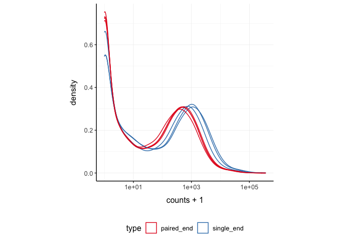

tidySummarizedExperiment - part of tidytranscriptomics
================

<!-- badges: start -->

[](https://www.tidyverse.org/lifecycle/#maturing)
[](https://github.com/stemangiola/tidySummarizedExperiment/actions)
<!-- badges: end -->

**Brings SummarizedExperiment to the tidyverse!**

website:
[stemangiola.github.io/tidySummarizedExperiment/](https://stemangiola.github.io/tidySummarizedExperiment/)

Please also have a look at

-   [tidySingleCellExperiment](https://stemangiola.github.io/tidySingleCellExperiment/)
    for tidy manipulation of SingleCellExperiment objects
-   [tidyseurat](https://stemangiola.github.io/tidyseurat/) for tidy
    manipulation of Seurat objects
-   [tidybulk](https://stemangiola.github.io/tidybulk/) for tidy
    analysis of RNA sequencing data
-   [nanny](https://github.com/stemangiola/nanny) for tidy high-level
    data analysis and manipulation
-   [tidygate](https://github.com/stemangiola/tidygate) for adding
    custom gate information to your tibble
-   [tidyHeatmap](https://stemangiola.github.io/tidyHeatmap/) for
    heatmaps produced with tidy principles

# Introduction

tidySummarizedExperiment provides a bridge between Bioconductor
[SummarizedExperiment](https://bioconductor.org/packages/release/bioc/html/SummarizedExperiment.html)
\[@morgan2020summarized\] and the tidyverse \[@wickham2019welcome\]. It
creates an invisible layer that enables viewing the Bioconductor
*SummarizedExperiment* object as a tidyverse tibble, and provides
SummarizedExperiment-compatible *dplyr*, *tidyr*, *ggplot* and *plotly*
functions. This allows users to get the best of both Bioconductor and
tidyverse worlds.

## Functions/utilities available

| SummarizedExperiment-compatible Functions | Description                                                                        |
|-------------------------------------------|------------------------------------------------------------------------------------|
| `all`                                     | After all `tidySummarizedExperiment` is a SummarizedExperiment object, just better |

| tidyverse Packages | Description                                 |
|--------------------|---------------------------------------------|
| `dplyr`            | Almost all `dplyr` APIs like for any tibble |
| `tidyr`            | Almost all `tidyr` APIs like for any tibble |
| `ggplot2`          | `ggplot` like for any tibble                |
| `plotly`           | `plot_ly` like for any tibble               |

| Utilities   | Description                                 |
|-------------|---------------------------------------------|
| `as_tibble` | Convert cell-wise information to a `tbl_df` |

## Installation

``` r
if (!requireNamespace("BiocManager", quietly=TRUE)) {
      install.packages("BiocManager")
  }

BiocManager::install("tidySummarizedExperiment")
```

From Github (development)

``` r
devtools::install_github("stemangiola/tidySummarizedExperiment")
```

Load libraries used in the examples.

``` r
library(ggplot2)
library(tidySummarizedExperiment)
```

# Create `tidySummarizedExperiment`, the best of both worlds!

This is a SummarizedExperiment object but it is evaluated as a tibble.
So it is fully compatible both with SummarizedExperiment and tidyverse
APIs.

``` r
pasilla_tidy <- tidySummarizedExperiment::pasilla 
```

**It looks like a tibble**

``` r
pasilla_tidy
```

    ## # A SummarizedExperiment-tibble abstraction: 102,193 × 5
    ## # Transcripts=14599 | Samples=7 | Assays=counts
    ##    .feature    .sample counts condition type      
    ##    <chr>       <chr>    <int> <chr>     <chr>     
    ##  1 FBgn0000003 untrt1       0 untreated single_end
    ##  2 FBgn0000008 untrt1      92 untreated single_end
    ##  3 FBgn0000014 untrt1       5 untreated single_end
    ##  4 FBgn0000015 untrt1       0 untreated single_end
    ##  5 FBgn0000017 untrt1    4664 untreated single_end
    ##  6 FBgn0000018 untrt1     583 untreated single_end
    ##  7 FBgn0000022 untrt1       0 untreated single_end
    ##  8 FBgn0000024 untrt1      10 untreated single_end
    ##  9 FBgn0000028 untrt1       0 untreated single_end
    ## 10 FBgn0000032 untrt1    1446 untreated single_end
    ## # … with 40 more rows

**But it is a SummarizedExperiment object after all**

``` r
assays(pasilla_tidy)
```

    ## List of length 1
    ## names(1): counts

# Tidyverse commands

We can use tidyverse commands to explore the tidy SummarizedExperiment
object.

We can use `slice` to choose rows by position, for example to choose the
first row.

``` r
pasilla_tidy %>%
    slice(1)
```

    ## # A SummarizedExperiment-tibble abstraction: 1 × 5
    ## # Transcripts=1 | Samples=1 | Assays=counts
    ##   .feature    .sample counts condition type      
    ##   <chr>       <chr>    <int> <chr>     <chr>     
    ## 1 FBgn0000003 untrt1       0 untreated single_end

We can use `filter` to choose rows by criteria.

``` r
pasilla_tidy %>%
    filter(condition == "untreated")
```

    ## # A SummarizedExperiment-tibble abstraction: 58,396 × 5
    ## # Transcripts=14599 | Samples=4 | Assays=counts
    ##    .feature    .sample counts condition type      
    ##    <chr>       <chr>    <int> <chr>     <chr>     
    ##  1 FBgn0000003 untrt1       0 untreated single_end
    ##  2 FBgn0000008 untrt1      92 untreated single_end
    ##  3 FBgn0000014 untrt1       5 untreated single_end
    ##  4 FBgn0000015 untrt1       0 untreated single_end
    ##  5 FBgn0000017 untrt1    4664 untreated single_end
    ##  6 FBgn0000018 untrt1     583 untreated single_end
    ##  7 FBgn0000022 untrt1       0 untreated single_end
    ##  8 FBgn0000024 untrt1      10 untreated single_end
    ##  9 FBgn0000028 untrt1       0 untreated single_end
    ## 10 FBgn0000032 untrt1    1446 untreated single_end
    ## # … with 40 more rows

We can use `select` to choose columns.

``` r
pasilla_tidy %>%
    select(sample)
```

    ## # A tibble: 102,193 × 1
    ##    sample
    ##    <chr> 
    ##  1 untrt1
    ##  2 untrt1
    ##  3 untrt1
    ##  4 untrt1
    ##  5 untrt1
    ##  6 untrt1
    ##  7 untrt1
    ##  8 untrt1
    ##  9 untrt1
    ## 10 untrt1
    ## # … with 102,183 more rows

We can use `count` to count how many rows we have for each sample.

``` r
pasilla_tidy %>%
    count(sample)
```

    ## # A tibble: 7 × 2
    ##   sample     n
    ##   <chr>  <int>
    ## 1 trt1   14599
    ## 2 trt2   14599
    ## 3 trt3   14599
    ## 4 untrt1 14599
    ## 5 untrt2 14599
    ## 6 untrt3 14599
    ## 7 untrt4 14599

We can use `distinct` to see what distinct sample information we have.

``` r
pasilla_tidy %>%
    distinct(sample, condition, type)
```

    ## # A tibble: 7 × 3
    ##   sample condition type      
    ##   <chr>  <chr>     <chr>     
    ## 1 untrt1 untreated single_end
    ## 2 untrt2 untreated single_end
    ## 3 untrt3 untreated paired_end
    ## 4 untrt4 untreated paired_end
    ## 5 trt1   treated   single_end
    ## 6 trt2   treated   paired_end
    ## 7 trt3   treated   paired_end

We could use `rename` to rename a column. For example, to modify the
type column name.

``` r
pasilla_tidy %>%
    rename(sequencing=type)
```

    ## # A SummarizedExperiment-tibble abstraction: 102,193 × 5
    ## # Transcripts=14599 | Samples=7 | Assays=counts
    ##    .feature    .sample counts condition sequencing
    ##    <chr>       <chr>    <int> <chr>     <chr>     
    ##  1 FBgn0000003 untrt1       0 untreated single_end
    ##  2 FBgn0000008 untrt1      92 untreated single_end
    ##  3 FBgn0000014 untrt1       5 untreated single_end
    ##  4 FBgn0000015 untrt1       0 untreated single_end
    ##  5 FBgn0000017 untrt1    4664 untreated single_end
    ##  6 FBgn0000018 untrt1     583 untreated single_end
    ##  7 FBgn0000022 untrt1       0 untreated single_end
    ##  8 FBgn0000024 untrt1      10 untreated single_end
    ##  9 FBgn0000028 untrt1       0 untreated single_end
    ## 10 FBgn0000032 untrt1    1446 untreated single_end
    ## # … with 40 more rows

We could use `mutate` to create a column. For example, we could create a
new type column that contains single and paired instead of single_end
and paired_end.

``` r
pasilla_tidy %>%
    mutate(type=gsub("_end", "", type))
```

    ## # A SummarizedExperiment-tibble abstraction: 102,193 × 5
    ## # Transcripts=14599 | Samples=7 | Assays=counts
    ##    .feature    .sample counts condition type  
    ##    <chr>       <chr>    <int> <chr>     <chr> 
    ##  1 FBgn0000003 untrt1       0 untreated single
    ##  2 FBgn0000008 untrt1      92 untreated single
    ##  3 FBgn0000014 untrt1       5 untreated single
    ##  4 FBgn0000015 untrt1       0 untreated single
    ##  5 FBgn0000017 untrt1    4664 untreated single
    ##  6 FBgn0000018 untrt1     583 untreated single
    ##  7 FBgn0000022 untrt1       0 untreated single
    ##  8 FBgn0000024 untrt1      10 untreated single
    ##  9 FBgn0000028 untrt1       0 untreated single
    ## 10 FBgn0000032 untrt1    1446 untreated single
    ## # … with 40 more rows

We could use `unite` to combine multiple columns into a single column.

``` r
pasilla_tidy %>%
    unite("group", c(condition, type))
```

    ## # A SummarizedExperiment-tibble abstraction: 102,193 × 4
    ## # Transcripts=14599 | Samples=7 | Assays=counts
    ##    .feature    .sample counts group               
    ##    <chr>       <chr>    <int> <chr>               
    ##  1 FBgn0000003 untrt1       0 untreated_single_end
    ##  2 FBgn0000008 untrt1      92 untreated_single_end
    ##  3 FBgn0000014 untrt1       5 untreated_single_end
    ##  4 FBgn0000015 untrt1       0 untreated_single_end
    ##  5 FBgn0000017 untrt1    4664 untreated_single_end
    ##  6 FBgn0000018 untrt1     583 untreated_single_end
    ##  7 FBgn0000022 untrt1       0 untreated_single_end
    ##  8 FBgn0000024 untrt1      10 untreated_single_end
    ##  9 FBgn0000028 untrt1       0 untreated_single_end
    ## 10 FBgn0000032 untrt1    1446 untreated_single_end
    ## # … with 40 more rows

We can also combine commands with the tidyverse pipe `%>%`.

For example, we could combine `group_by` and `summarise` to get the
total counts for each sample.

``` r
pasilla_tidy %>%
    group_by(sample) %>%
    summarise(total_counts=sum(counts))
```

    ## # A tibble: 7 × 2
    ##   sample total_counts
    ##   <chr>         <int>
    ## 1 trt1       18670279
    ## 2 trt2        9571826
    ## 3 trt3       10343856
    ## 4 untrt1     13972512
    ## 5 untrt2     21911438
    ## 6 untrt3      8358426
    ## 7 untrt4      9841335

We could combine `group_by`, `mutate` and `filter` to get the
transcripts with mean count \> 0.

``` r
pasilla_tidy %>%
    group_by(feature) %>%
    mutate(mean_count=mean(counts)) %>%
    filter(mean_count > 0)
```

    ## # A tibble: 86,513 × 6
    ## # Groups:   feature [12,359]
    ##    feature     sample counts condition type       mean_count
    ##    <chr>       <chr>   <int> <chr>     <chr>           <dbl>
    ##  1 FBgn0000003 untrt1      0 untreated single_end      0.143
    ##  2 FBgn0000008 untrt1     92 untreated single_end     99.6  
    ##  3 FBgn0000014 untrt1      5 untreated single_end      1.43 
    ##  4 FBgn0000015 untrt1      0 untreated single_end      0.857
    ##  5 FBgn0000017 untrt1   4664 untreated single_end   4672.   
    ##  6 FBgn0000018 untrt1    583 untreated single_end    461.   
    ##  7 FBgn0000022 untrt1      0 untreated single_end      0.143
    ##  8 FBgn0000024 untrt1     10 untreated single_end      7    
    ##  9 FBgn0000028 untrt1      0 untreated single_end      0.429
    ## 10 FBgn0000032 untrt1   1446 untreated single_end   1085.   
    ## # … with 86,503 more rows

# Plotting

``` r
my_theme <-
    list(
        scale_fill_brewer(palette="Set1"),
        scale_color_brewer(palette="Set1"),
        theme_bw() +
            theme(
                panel.border=element_blank(),
                axis.line=element_line(),
                panel.grid.major=element_line(size=0.2),
                panel.grid.minor=element_line(size=0.1),
                text=element_text(size=12),
                legend.position="bottom",
                aspect.ratio=1,
                strip.background=element_blank(),
                axis.title.x=element_text(margin=margin(t=10, r=10, b=10, l=10)),
                axis.title.y=element_text(margin=margin(t=10, r=10, b=10, l=10))
            )
    )
```

We can treat `pasilla_tidy` as a normal tibble for plotting.

Here we plot the distribution of counts per sample.

``` r
pasilla_tidy %>%
    tidySummarizedExperiment::ggplot(aes(counts + 1, group=.sample, color=`type`)) +
    geom_density() +
    scale_x_log10() +
    my_theme
```

<!-- -->
